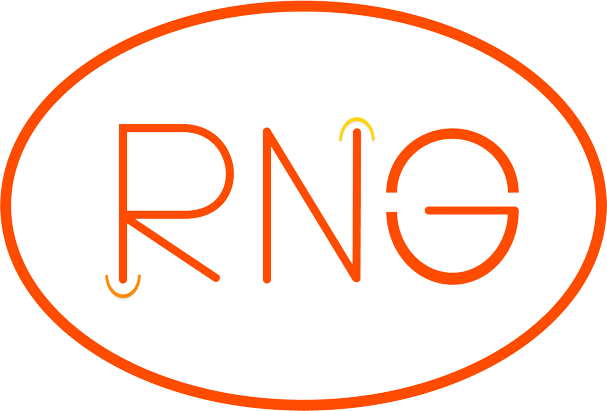
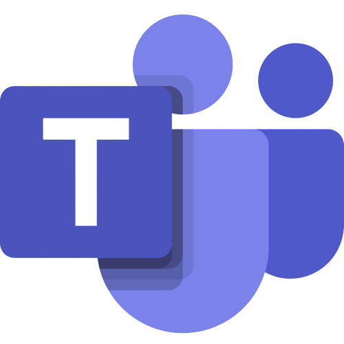
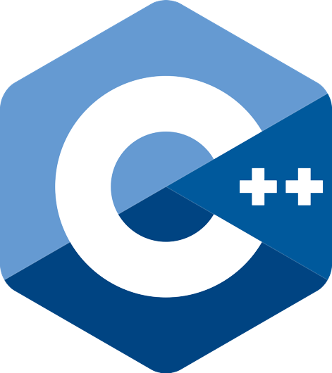
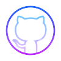
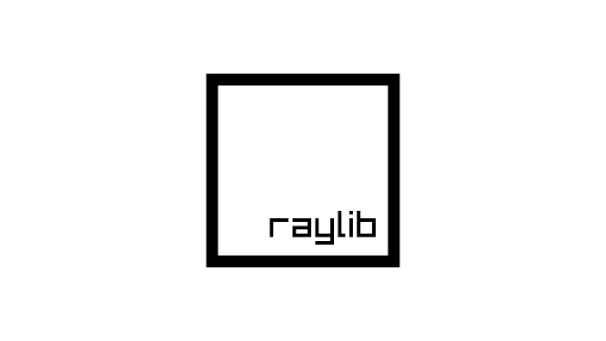

# Team Renegades

 

## 💻 Used tecnologies for documentation, communication and visual elements:

  
  
  
  
  

## 💻 Used tecnologies for the game:

<a href = "https://codingburgas-my.sharepoint.com/:p:/g/personal/dmdimitrov20_codingburgas_bg/EUjKcjz2_vpEpdaXiT7MmQABAJi_4oWDHk81n4EztPXgLg">Presentation</a> 
<a href = "https://codingburgas-my.sharepoint.com/:w:/g/personal/dmdimitrov20_codingburgas_bg/EQJYbJO5F09CtQmLDj8WIhMBys6lTXXxKrHyuwFTStfwIA">Documentation</a> 
<a href = "https://codingburgas-my.sharepoint.com/:x:/g/personal/dmdimitrov20_codingburgas_bg/EUOPvYmDhaVAk7tzIO8x1i8BBUPxxawZ8VO6YdpF7HNspw">QA Documentation</a> 

## 😃 Our Team:

- <a href = "https://github.com/DMDimitrov20"> Dimitar Dimitrov </a> (Scrum Trainer)
- <a href = "https://github.com/ASStoyanov20"> Aleks Stoyanov </a> (Back-end Developer)
- <a href = "https://github.com/DDStaykov20"> Dimitar Staykov </a> (Back-end Developer)
- <a href = "https://github.com/GSTabanov20"> Georgi Tabanov </a> (Quality Assurance Engineer)
